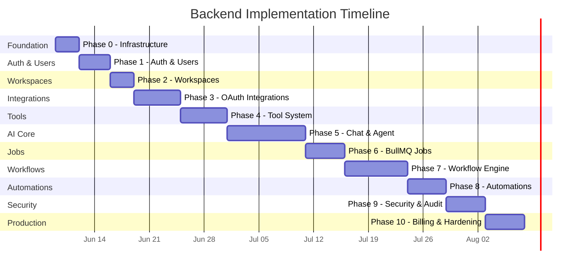

# AI Worker — Backend Implementation Plan

> Phased execution plan for building the backend of an AI Operating System for Work.
> Each phase is self-contained, testable, and builds on the previous one.

---

## Overview

```
Phase 0 — Project Foundation & Infrastructure          (Days 1–3)
Phase 1 — Authentication & User Management             (Days 4–7)
Phase 2 — Workspaces & Multi-Tenancy                   (Days 8–10)
Phase 3 — OAuth Integration Framework                  (Days 11–16)
Phase 4 — Tool System Architecture                     (Days 17–22)
Phase 5 — Chat System & AI Agent (Core Loop)           (Days 23–32)
Phase 6 — BullMQ Job Infrastructure                    (Days 33–37)
Phase 7 — Workflow Engine                              (Days 38–45)
Phase 8 — Automation Engine                            (Days 46–50)
Phase 9 — Audit Logs, Security & Rate Limiting         (Days 51–55)
Phase 10 — Billing Readiness & Production Hardening    (Days 56–60)
```



---

## Phase 0 — Project Foundation & Infrastructure

> **Goal**: Set up the Express + TypeScript project properly with all dependencies,
> configuration, database connection, Redis connection, and project conventions.

### 0.1 Install Core Dependencies

```bash
cd apps/api
pnpm add express cors helmet dotenv zod ioredis @supabase/supabase-js cuid2
pnpm add -D @types/express @types/cors @types/node typescript tsx nodemon
```

### 0.2 Configure TypeScript

**File**: `apps/api/tsconfig.json`

```
- Set target: ES2022, module: NodeNext
- Enable strict mode, sourceMap, declaration
- Set rootDir: ./src, outDir: ./dist
- Add path aliases: @/* → src/*
```

### 0.3 Create Config Module

```
apps/api/src/config/
├── env.ts              # Zod schema to validate ALL env vars at startup
├── database.ts         # Supabase client initialization (singleton)
├── redis.ts            # ioredis client initialization (singleton)
└── cors.ts             # CORS whitelist config
```

#### `env.ts` — What to implement:

```typescript
// Define Zod schema for every env var:
//   PORT, NODE_ENV, SUPABASE_URL, SUPABASE_KEY, SUPABASE_SERVICE_KEY,
//   REDIS_URL, ENCRYPTION_KEY, GEMINI_API_KEY,
//   GOOGLE_CLIENT_ID, GOOGLE_CLIENT_SECRET, GOOGLE_REDIRECT_URI,
//   GITHUB_CLIENT_ID, GITHUB_CLIENT_SECRET, GITHUB_REDIRECT_URI,
//   FRONTEND_URL
//
// Parse and validate at import time. Crash immediately if invalid.
// Export typed `env` object used everywhere.
```

#### `database.ts` — What to implement:

```typescript
// Create Supabase client with service_role key (server-side)
// Export singleton `supabase` client
// Create a helper: `getWorkspaceClient(workspaceId)` that sets
//   the RLS context via: supabase.rpc('set_config', { key: 'app.workspace_id', value: workspaceId })
```

#### `redis.ts` — What to implement:

```typescript
// Create ioredis client from REDIS_URL
// Handle connection errors, reconnect strategy
// Export singleton `redis` client
```

### 0.4 Create Express App Bootstrap

```
apps/api/src/
├── index.ts            # Entry point — import app, start server
└── server.ts           # Express app setup — middleware stack
```

#### `server.ts` — Middleware stack order:

```
1. helmet()                              — Security headers
2. cors(corsConfig)                      — CORS
3. express.json({ limit: '10mb' })       — Body parser
4. requestLogger                         — Log method, path, duration
5. Routes (mounted here)
6. 404 handler
7. Global error handler
```

### 0.5 Create Shared Utilities

```
apps/api/src/shared/
├── errors/
│   ├── app-error.ts            # Custom AppError class (code, message, statusCode, details)
│   └── error-codes.ts          # Enum of all error codes
├── middleware/
│   ├── error-handler.ts        # Global error handler middleware
│   ├── request-logger.ts       # Request logging (method, path, status, duration)
│   └── validation.ts           # Zod-based request validation middleware factory
├── utils/
│   ├── id.ts                   # ID generator using cuid2
│   ├── crypto.ts               # AES-256-GCM encrypt / decrypt
│   ├── pagination.ts           # Pagination helper (offset, limit, total → meta)
│   └── date.ts                 # Date formatting helpers
├── types/
│   ├── express.d.ts            # Augment Express Request with user, workspace, membership
│   └── common.types.ts         # Shared types: PaginatedResponse, ApiResponse
└── constants/
    ├── roles.ts                # WorkspaceRole enum
    └── limits.ts               # Rate limits, pagination defaults
```

#### Key implementation details:

**`app-error.ts`**:
```typescript
// class AppError extends Error {
//   constructor(
//     public code: string,        // 'AUTH_FAILED', 'NOT_FOUND', etc.
//     public message: string,
//     public statusCode: number = 400,
//     public details?: unknown
//   )
// }
```

**`error-handler.ts`**:
```typescript
// Catch AppError → return { error: { code, message, details } }
// Catch Zod errors → return 422 with validation details
// Catch unknown → return 500 with generic message
// Log all errors with stack trace in development
```

**`validation.ts`**:
```typescript
// Factory: validate(schema: ZodSchema, source: 'body' | 'query' | 'params')
// Returns middleware that parses request[source] against schema
// Throws 422 AppError on failure with field-level details
```

**`crypto.ts`**:
```typescript
// encrypt(plaintext: string): string
//   - Generate random 16-byte IV
//   - AES-256-GCM encrypt with ENCRYPTION_KEY
//   - Return "iv:authTag:ciphertext" (all base64)
//
// decrypt(encrypted: string): string
//   - Split on ':'
//   - AES-256-GCM decrypt
//   - Return plaintext
```

### 0.6 Create Database Migrations

```
apps/api/src/database/
├── client.ts                   # Re-export from config/database.ts
├── migrations/
│   └── 001_initial_schema.sql  # All tables for Phase 0 (users only)
└── seed/
    └── seed.ts                 # Dev seed data
```

### 0.7 Update package.json Scripts

```json
{
  "scripts": {
    "dev": "tsx watch src/index.ts",
    "build": "tsc -b",
    "start": "node dist/index.js",
    "lint": "eslint src/",
    "test": "vitest",
    "db:migrate": "supabase migration up",
    "db:seed": "tsx src/database/seed/seed.ts"
  }
}
```

### 0.8 Verification Checklist

```
□ `pnpm dev` starts server on PORT, logs "Server running on :3001"
□ GET /health returns { status: 'ok', timestamp, uptime }
□ Supabase client connects (test with a raw query)
□ Redis client connects (test with PING → PONG)
□ Invalid env vars crash the server immediately with clear error
□ Unknown routes return 404 with standard error format
□ Thrown errors return proper JSON error response
```

---

## Phase 1 — Authentication & User Management

> **Goal**: Users can sign in with Google OAuth, receive a JWT, and access their profile.

### 1.1 Database — Users Table

**File**: `migrations/001_create_users.sql`

```sql
-- users table (see architecture doc for full schema)
-- Indexes: idx_users_email (unique), idx_users_provider (unique composite)
```

### 1.2 Auth Module

```
apps/api/src/modules/auth/
├── auth.router.ts              # POST /auth/google, POST /auth/refresh, POST /auth/logout, GET /auth/me
├── auth.controller.ts          # Request handling, call service, return response
├── auth.service.ts             # Core auth logic
├── auth.middleware.ts          # JWT verification middleware
├── auth.types.ts               # AuthPayload, TokenPair, GoogleTokenResponse
└── strategies/
    └── google.strategy.ts      # Google OAuth code exchange + profile fetch
```

#### `google.strategy.ts` — Execution steps:

```
1. Receive authorization code from frontend
2. Exchange code for tokens with Google OAuth2 endpoint:
     POST https://oauth2.googleapis.com/token
     { code, client_id, client_secret, redirect_uri, grant_type: 'authorization_code' }
3. Fetch user profile:
     GET https://www.googleapis.com/oauth2/v2/userinfo
     Authorization: Bearer <access_token>
4. Return { email, name, picture, googleId }
```

#### `auth.service.ts` — Execution steps:

```
1. googleLogin(code: string):
   a. Call googleStrategy.exchangeCode(code)  → { email, name, picture, googleId }
   b. Upsert user in DB:
      - Find by (auth_provider='google', provider_id=googleId)
      - If exists → update last_login_at, return user
      - If not → INSERT user, auto-create workspace (Phase 2), return user
   c. Generate JWT:
      - Sign with Supabase service key or custom secret
      - Payload: { sub: userId, email, workspaceId }
      - Access token: 15min expiry
      - Refresh token: 7 day expiry, stored in httpOnly cookie
   d. Return { accessToken, refreshToken, user }

2. refreshToken(token: string):
   a. Verify refresh token
   b. Check not revoked (stored in Redis: `refresh:{token}`)
   c. Issue new access + refresh token pair
   d. Revoke old refresh token

3. logout(refreshToken: string):
   a. Add refresh token to Redis revocation set (TTL = token expiry)
```

#### `auth.middleware.ts` — Execution steps:

```
1. Extract Bearer token from Authorization header
2. Verify JWT signature and expiry
3. Decode payload → { sub, email, workspaceId }
4. Attach to req.user = { id, email, workspaceId }
5. If invalid → throw 401 AppError('AUTH_REQUIRED')
```

### 1.3 Users Module

```
apps/api/src/modules/users/
├── users.router.ts             # GET /users/me, PATCH /users/me, DELETE /users/me
├── users.controller.ts
├── users.service.ts
└── users.types.ts
```

#### `users.service.ts` — Methods:

```
- getById(id: string): User
- getByEmail(email: string): User | null
- update(id: string, data: UpdateUserDto): User
- delete(id: string): void   // Soft delete, mark as deleted
```

### 1.4 Wire Up Routes

**File**: `server.ts`

```typescript
// app.use('/api/v1/auth', authRouter);
// app.use('/api/v1/users', authMiddleware, usersRouter);
```

### 1.5 Verification Checklist

```
□ POST /api/v1/auth/google with valid code → returns { accessToken, user }
□ GET /api/v1/auth/me with valid JWT → returns user profile
□ GET /api/v1/auth/me without JWT → returns 401
□ GET /api/v1/auth/me with expired JWT → returns 401
□ POST /api/v1/auth/refresh with valid refresh token → returns new tokens
□ POST /api/v1/auth/logout → invalidates refresh token
□ PATCH /api/v1/users/me → updates user profile
□ Second login with same Google account → same user, updated last_login_at
□ User row created in Supabase with correct fields
```

---

## Phase 2 — Workspaces & Multi-Tenancy

> **Goal**: Every user belongs to a workspace. All subsequent data is scoped to a workspace.

### 2.1 Database — Workspaces & Memberships

**File**: `migrations/002_create_workspaces.sql`

```sql
-- workspaces table
-- memberships table (user_id, workspace_id, role)
-- Indexes: idx_workspaces_slug (unique), idx_memberships_workspace, idx_memberships_user
```

### 2.2 Workspaces Module

```
apps/api/src/modules/workspaces/
├── workspaces.router.ts
├── workspaces.controller.ts
├── workspaces.service.ts
├── workspaces.middleware.ts     # Resolve workspace from X-Workspace-Id header
└── workspaces.types.ts
```

#### `workspaces.service.ts` — Methods:

```
- create(ownerId: string, data: CreateWorkspaceDto): Workspace
    → Auto-creates membership with role='owner'
    → Generates slug from name (slugify + uniqueness check)

- getById(id: string): Workspace
- getBySlug(slug: string): Workspace
- getUserWorkspaces(userId: string): Workspace[]
- update(id: string, data: UpdateWorkspaceDto): Workspace
- delete(id: string): void

- addMember(workspaceId: string, userId: string, role: WorkspaceRole): Membership
- removeMember(workspaceId: string, userId: string): void
- updateMemberRole(workspaceId: string, userId: string, role: WorkspaceRole): Membership
- getMembers(workspaceId: string): (Membership & User)[]
- getMembership(workspaceId: string, userId: string): Membership | null
```

#### `workspaces.middleware.ts` — Execution steps:

```
1. Read X-Workspace-Id header (or from JWT claims)
2. Verify workspace exists
3. Verify req.user has a membership in this workspace
4. Attach to req.workspace and req.membership (with role)
5. If no access → throw 403 AppError('WORKSPACE_ACCESS_DENIED')
```

### 2.3 Auto-Create Workspace on Signup

Update `auth.service.ts`:

```
In googleLogin(), after user creation:
  1. Create workspace with name = "{user.full_name}'s Workspace"
  2. Create membership with role = 'owner'
  3. Include workspaceId in JWT payload
```

### 2.4 Wire Up Routes

```
app.use('/api/v1/workspaces', authMiddleware, workspacesRouter);

// All workspace-scoped routes now use:
app.use('/api/v1/integrations', authMiddleware, workspaceMiddleware, integrationsRouter);
app.use('/api/v1/chat',         authMiddleware, workspaceMiddleware, chatRouter);
// ... etc
```

### 2.5 Verification Checklist

```
□ New user signup → workspace auto-created, membership with role='owner'
□ GET /api/v1/users/me/workspaces → returns user's workspaces
□ POST /api/v1/workspaces → creates new workspace
□ GET /api/v1/workspaces/:id → returns workspace (only if member)
□ Accessing another user's workspace → 403
□ X-Workspace-Id header required for all scoped routes
□ Members list shows correct roles
□ Slug generation works and is unique
```

---

## Phase 3 — OAuth Integration Framework

> **Goal**: Users can connect Gmail, Google Calendar, Notion, GitHub, Vercel, Render.
> Tokens are encrypted at rest and auto-refreshed.

### 3.1 Database — Integrations & OAuth Tokens

**File**: `migrations/003_create_integrations.sql`

```sql
-- integrations table
-- oauth_tokens table (encrypted access + refresh tokens)
```

### 3.2 Integrations Module

```
apps/api/src/modules/integrations/
├── integrations.router.ts
├── integrations.controller.ts
├── integrations.service.ts
├── oauth.service.ts
├── integrations.types.ts
└── providers/
    ├── google.provider.ts        # Gmail + Calendar OAuth (shared Google OAuth)
    ├── notion.provider.ts        # Notion OAuth
    ├── github.provider.ts        # GitHub OAuth
    ├── vercel.provider.ts        # Vercel token-based
    └── render.provider.ts        # Render token-based
```

#### OAuth Flow — Execution steps for each provider:

```
Step 1: Frontend calls GET /api/v1/integrations/:provider/connect
        → Backend generates OAuth URL with:
            - client_id, redirect_uri, scopes, state (CSRF token stored in Redis)
        → Returns { authUrl }

Step 2: User authorizes in browser → redirected to callback URL

Step 3: GET /api/v1/integrations/:provider/callback?code=xxx&state=yyy
        → Backend:
            a. Verify state token from Redis (prevent CSRF)
            b. Exchange code for tokens with provider
            c. Encrypt access_token and refresh_token (AES-256-GCM)
            d. Create integration record (provider, status='active', scopes)
            e. Create oauth_tokens record (encrypted tokens, expires_at)
            f. Redirect to frontend success page
```

#### `oauth.service.ts` — Methods:

```
- generateAuthUrl(provider: string, workspaceId: string): { authUrl, state }
- handleCallback(provider: string, code: string, state: string): Integration
- getDecryptedTokens(integrationId: string): { accessToken, refreshToken, expiresAt }
- refreshToken(integration: Integration): { accessToken, expiresAt }
    → Provider-specific refresh logic
    → Re-encrypt new tokens
    → Update oauth_tokens record
- revokeTokens(integrationId: string): void
```

#### Provider-specific configs:

```typescript
// Each provider file exports:
interface OAuthProviderConfig {
    name: string;
    authUrl: string;
    tokenUrl: string;
    scopes: string[];
    clientId: string;
    clientSecret: string;
    redirectUri: string;

    exchangeCode(code: string): Promise<OAuthTokens>;
    refreshToken(refreshToken: string): Promise<OAuthTokens>;
    revokeToken(accessToken: string): Promise<void>;
    getUserInfo(accessToken: string): Promise<ProviderUserInfo>;
}
```

#### Provider Implementation Details:

**Google (Gmail + Calendar)**:
```
Auth URL:  https://accounts.google.com/o/oauth2/v2/auth
Token URL: https://oauth2.googleapis.com/token
Scopes:    gmail.readonly, gmail.send, gmail.modify,
           calendar.readonly, calendar.events
Refresh:   POST to token URL with grant_type=refresh_token
```

**Notion**:
```
Auth URL:  https://api.notion.com/v1/oauth/authorize
Token URL: https://api.notion.com/v1/oauth/token
Scopes:    (Notion uses internal integration, no scopes)
Note:      Notion tokens don't expire, no refresh needed
```

**GitHub**:
```
Auth URL:  https://github.com/login/oauth/authorize
Token URL: https://github.com/login/oauth/access_token
Scopes:    repo, read:org, read:user
Refresh:   GitHub OAuth tokens don't expire by default
           (GitHub Apps use installation tokens — different flow)
```

**Vercel & Render**:
```
These use API tokens (not OAuth flows)
User pastes their token in the UI
Backend encrypts and stores it
No refresh needed — tokens are long-lived
```

### 3.3 Integration Health Check

```
GET /api/v1/integrations/:id/status
  → Decrypt token
  → Make a lightweight API call to the provider:
      Gmail: GET /gmail/v1/users/me/profile
      Notion: GET /v1/users/me
      GitHub: GET /user
      Vercel: GET /v13/user
  → Return { connected: true/false, error?: string }
```

### 3.4 Verification Checklist

```
□ GET /integrations/gmail/connect → returns Google OAuth URL
□ OAuth callback creates integration + encrypted oauth_tokens
□ GET /integrations → lists workspace integrations with status
□ Tokens are encrypted in DB (verify by checking raw DB value)
□ decrypt(encrypt(token)) === token
□ Token refresh works (simulate expired token)
□ DELETE /integrations/:id → revokes tokens, marks integration as revoked
□ Health check returns correct status for each provider
□ CSRF state token prevents replay attacks
□ Same provider can't be connected twice by same user in same workspace
```

---

## Phase 4 — Tool System Architecture

> **Goal**: Build the generic tool framework. Implement Gmail and Notion tools first.

### 4.1 Tool Core Framework

```
apps/api/src/tools/
├── tool.types.ts               # ITool, IToolAction, ToolResult, ToolExecutionContext
├── tool.registry.ts            # ToolRegistry class (register, resolve, getAvailable)
├── tool.executor.ts            # ToolExecutor class (execute with retry, permission check)
├── tool.permissions.ts         # Per-workspace tool ACL check
└── providers/
    ├── gmail/
    │   ├── gmail.tool.ts       # GmailTool implements ITool
    │   ├── gmail.actions.ts    # search, read, send, reply action implementations
    │   └── gmail.types.ts
    ├── google-calendar/
    │   ├── calendar.tool.ts
    │   ├── calendar.actions.ts # listEvents, createEvent, findFreeTime
    │   └── calendar.types.ts
    ├── notion/
    │   ├── notion.tool.ts
    │   ├── notion.actions.ts   # searchPages, readPage, createPage, queryDatabase
    │   └── notion.types.ts
    ├── github/
    │   ├── github.tool.ts
    │   ├── github.actions.ts   # listRepos, createIssue, createPR, triggerWorkflow
    │   └── github.types.ts
    ├── vercel/
    │   ├── vercel.tool.ts
    │   ├── vercel.actions.ts   # listProjects, triggerDeploy, getDeploymentLogs
    │   └── vercel.types.ts
    └── render/
        ├── render.tool.ts
        ├── render.actions.ts   # listServices, triggerDeploy, getLogs
        └── render.types.ts
```

### 4.2 Core Interfaces — Implementation Details

#### `tool.types.ts`:

```typescript
// ITool interface:
//   name: string                           — 'gmail', 'notion', etc.
//   description: string                    — Human description for LLM
//   provider: IntegrationProvider           — Which OAuth provider it needs
//   actions: IToolAction[]                 — List of available actions
//   getFunctionDeclarations(): FunctionDeclaration[]  — For Gemini function calling

// IToolAction interface:
//   name: string                           — 'search', 'read', 'send'
//   description: string                    — Human description for LLM
//   parameters: JSONSchema                 — Zod schema → JSON Schema for params
//   execute(ctx: ToolExecutionContext): Promise<ToolResult>

// ToolExecutionContext:
//   workspaceId, userId, integrationId, accessToken, args

// ToolResult:
//   success: boolean
//   data?: unknown
//   error?: { code, message, retryable }
//   metadata?: { durationMs, apiCallCount }
```

#### `tool.registry.ts` — Execution steps:

```
1. Singleton class with Map<string, ITool>
2. register(tool: ITool) → add to map, validate no duplicates
3. resolve(name: string) → return tool or undefined
4. getAvailableTools(workspaceId: string):
   a. Query integrations table for active integrations in this workspace
   b. Filter registered tools to only those whose provider is connected
   c. Return filtered tools
5. getFunctionDeclarations(workspaceId: string):
   a. Get available tools
   b. Flatten all actions into Gemini FunctionDeclaration format
   c. Tool action names use format: {tool}_{action} (e.g., 'gmail_search')
```

#### `tool.executor.ts` — Execution steps:

```
1. Parse tool action name: 'gmail_search' → tool='gmail', action='search'
2. Resolve tool from registry
3. Find action on tool
4. Check workspace has the required integration (active)
5. Check permissions (tool.permissions.ts)
6. Decrypt access token via oauth.service
7. Check token expiry → refresh if needed
8. Execute with retry (exponential backoff, max 2 retries)
9. Log execution to tool_executions table
10. Return ToolResult
```

### 4.3 Gmail Tool — Implementation Details

**Actions to implement**:

| Action | Gmail API Endpoint | Parameters |
|--------|-------------------|------------|
| `search` | `GET /gmail/v1/users/me/messages` | query (string), maxResults (number) |
| `read` | `GET /gmail/v1/users/me/messages/:id` | messageId (string), format ('full' \| 'metadata') |
| `send` | `POST /gmail/v1/users/me/messages/send` | to (string), subject (string), body (string), cc?, bcc? |
| `reply` | `POST /gmail/v1/users/me/messages/send` | messageId (string), body (string), replyAll? (boolean) |
| `label` | `POST /gmail/v1/users/me/messages/:id/modify` | messageId (string), addLabels (string[]), removeLabels (string[]) |

**Implementation notes**:
```
- Use googleapis npm package: pnpm add googleapis
- Gmail messages are base64url encoded — decode body
- For send: construct RFC 2822 message, base64url encode
- For reply: include In-Reply-To and References headers
- Parse email bodies: prefer text/plain, fallback to text/html → strip tags
- Limit response size: return snippet + first 2000 chars of body
```

### 4.4 Notion Tool — Implementation Details

**Actions to implement**:

| Action | Notion API Endpoint | Parameters |
|--------|-------------------|------------|
| `searchPages` | `POST /v1/search` | query (string), filter? (page \| database) |
| `readPage` | `GET /v1/pages/:id` + `GET /v1/blocks/:id/children` | pageId (string) |
| `createPage` | `POST /v1/pages` | parentId (string), title (string), content (markdown string) |
| `updatePage` | `PATCH /v1/pages/:id` | pageId (string), properties (object) |
| `queryDatabase` | `POST /v1/databases/:id/query` | databaseId (string), filter? (object), sorts? (array) |

**Implementation notes**:
```
- Use @notionhq/client npm package: pnpm add @notionhq/client
- Notion uses block-based content — convert markdown → Notion blocks
- For createPage: build a block tree from markdown
- readPage needs 2 calls: page properties + block children (recursive)
- Handle Notion's 100-item pagination with has_more / next_cursor
```

### 4.5 GitHub, Vercel, Render Tools — Stub Implementation

```
For MVP, create the tool class + register it, but implement only 2-3 key actions:

GitHub:  listRepos, createIssue
Vercel:  listProjects, triggerDeploy
Render:  listServices, triggerDeploy

Mark remaining actions as TODO.
```

### 4.6 Tool Registration at Startup

**File**: `src/index.ts` (or `src/tools/register.ts`)

```typescript
// Import and register all tools:
// toolRegistry.register(new GmailTool());
// toolRegistry.register(new GoogleCalendarTool());
// toolRegistry.register(new NotionTool());
// toolRegistry.register(new GitHubTool());
// toolRegistry.register(new VercelTool());
// toolRegistry.register(new RenderTool());
```

### 4.7 Database — Tool Executions Table

**File**: `migrations/004_create_tool_executions.sql`

### 4.8 Verification Checklist

```
□ ToolRegistry.register() stores tool, prevents duplicates
□ ToolRegistry.resolve('gmail') returns GmailTool
□ ToolRegistry.getAvailableTools(wsId) only returns tools with active integrations
□ ToolExecutor.execute('gmail_search', { query: 'test' }) calls Gmail API
□ ToolExecutor retries on retryable errors
□ ToolExecutor logs execution to tool_executions table
□ Gmail search returns parsed email list
□ Gmail read returns decoded email body
□ Notion createPage creates a page with markdown content
□ Notion queryDatabase returns filtered results
□ Tool execution with disconnected integration returns clean error
□ Token refresh works during tool execution
```

---

## Phase 5 — Chat System & AI Agent (Core Loop)

> **Goal**: Users can chat with the AI, which can plan and execute multi-tool actions.
> This is the core product loop.

### 5.1 Database — Conversations, Messages, Agent Memory

**File**: `migrations/005_create_conversations.sql`

```sql
-- conversations table
-- messages table (with tool_calls JSONB, token_count)
-- agent_memory table (with vector embedding column — enable pgvector extension)
```

### 5.2 Chat Module

```
apps/api/src/modules/chat/
├── chat.router.ts              # REST + SSE endpoints
├── chat.controller.ts
├── chat.service.ts             # Conversation CRUD, message management
├── chat.gateway.ts             # SSE streaming setup (WebSocket in Phase 10)
└── chat.types.ts
```

#### `chat.service.ts` — Methods:

```
- createConversation(workspaceId, userId, title?): Conversation
- getConversation(id): Conversation + last message
- listConversations(workspaceId, userId, pagination): Conversation[]
- archiveConversation(id): void

- addMessage(conversationId, { role, content, toolCalls? }): Message
- getMessages(conversationId, pagination): Message[]
- getRecentMessages(conversationId, limit: 20): Message[]
  → Returns last N messages for context window

- updateConversationSummary(id, summary): void
  → Called by memory manager after summarization
```

#### `chat.gateway.ts` — SSE Streaming:

```
1. POST /api/v1/chat/conversations/:id/messages
   a. Accept user message
   b. Set response headers for SSE:
      Content-Type: text/event-stream
      Cache-Control: no-cache
      Connection: keep-alive
   c. Call agent orchestrator
   d. Stream chunks as SSE events:
      event: text\ndata: {"content": "..."}\n\n
      event: tool_start\ndata: {"tool": "gmail_search"}\n\n
      event: tool_result\ndata: {"tool": "gmail_search", "success": true}\n\n
      event: done\ndata: {}\n\n
   e. Close SSE connection
```

### 5.3 Agent System

```
apps/api/src/agents/
├── agent.orchestrator.ts       # Top-level: receive message → coordinate → respond
├── planner.agent.ts            # Decompose user request → plan (via Gemini)
├── executor.agent.ts           # Execute plan steps (tool calls)
├── memory/
│   ├── memory.manager.ts       # Extract and persist long-term memories
│   ├── context.builder.ts      # Assemble prompt context (history + memory + tools)
│   └── summarizer.ts           # Summarize conversation when it gets long
├── prompts/
│   ├── system.prompt.ts        # Base system prompt for the AI
│   ├── planner.prompt.ts       # Planning-specific instructions
│   └── executor.prompt.ts      # Execution-specific instructions
└── agent.types.ts              # AgentPlan, AgentStep, StreamChunk, etc.
```

### 5.4 Install Gemini SDK

```bash
pnpm add @google/genai
```

### 5.5 System Prompt Design

**File**: `prompts/system.prompt.ts`

```
You are an AI assistant for workplace productivity. You help users manage their
work across multiple applications.

CAPABILITIES:
- You can read, search, and send emails via Gmail
- You can create and manage calendar events
- You can search, read, and create Notion pages
- You can manage GitHub repositories and issues
- You can trigger and monitor deployments on Vercel and Render

RULES:
1. Always confirm before sending emails or creating/modifying external resources
2. When the user's request requires multiple steps, plan them first and explain
3. If a tool returns an error, explain it clearly and suggest alternatives
4. Never expose raw API responses — summarize them naturally
5. If you're unsure which tool to use, ask the user for clarification

CONNECTED INTEGRATIONS: {{integrations}}
USER PREFERENCES: {{memories}}
```

### 5.6 Context Builder — Execution Steps

**File**: `memory/context.builder.ts`

```
async buildContext(workspaceId, conversationId, userMessage):

1. SYSTEM PROMPT
   - Load base system prompt template
   - Inject workspace integrations list (which tools are available)
   - Inject relevant long-term memories (see step 3)

2. CONVERSATION HISTORY
   - If conversation has a summary → use it as first message
   - Load last 20 messages from DB
   - Calculate total token count
   - If > 80k tokens → trigger summarization of older messages
   - Format as Gemini Content[] array

3. LONG-TERM MEMORY
   - Embed userMessage using Gemini text-embedding-004
   - Query agent_memory table with cosine similarity (pgvector)
   - Return top 5 most relevant memories
   - Inject into system prompt under "USER PREFERENCES"

4. TOOL DEFINITIONS
   - Call toolRegistry.getFunctionDeclarations(workspaceId)
   - Filter to only connected + permitted tools
   - Return as Gemini Tool[] for function calling

Return: { systemPrompt, messages, toolDefinitions, memories }
```

### 5.7 Agent Orchestrator — Core Loop

**File**: `agent.orchestrator.ts`

```
async *handleUserMessage(workspaceId, conversationId, userMessage):

1. Save user message to DB
2. Build context (contextBuilder.build)
3. Enter agent loop (max 10 iterations):

   LOOP:
   a. Call Gemini generateContent with:
      - systemInstruction = context.systemPrompt
      - contents = context.messages
      - tools = [{ functionDeclarations: context.toolDefinitions }]
      - generationConfig = { temperature: 0.7, maxOutputTokens: 8192 }

   b. Parse response:
      IF text response:
        - Save assistant message to DB
        - yield { type: 'text', content }
        - BREAK loop

      IF function call:
        - yield { type: 'tool_start', tool: name }
        - Execute via toolExecutor.execute(workspaceId, name, args)
        - Log to tool_executions
        - Append function call + result to context.messages
        - yield { type: 'tool_result', tool: name, result }
        - CONTINUE loop (Gemini will process the result)

4. After loop: extract and persist memories
5. Update conversation.updated_at
```

### 5.8 Memory Manager

**File**: `memory/memory.manager.ts`

```
async extractAndPersist(workspaceId, conversationId):

1. Get the last exchange (user message + assistant response)
2. Call Gemini with extraction prompt:
   "Extract any user preferences, important facts, or instructions
    from this exchange. Return as JSON array: [{category, content}]"
3. For each extracted memory:
   a. Embed content using text-embedding-004
   b. Check for duplicate/similar memories (cosine similarity > 0.95)
   c. If similar exists → update relevance_score, skip insert
   d. If new → INSERT into agent_memory with embedding
```

### 5.9 Conversation Summarizer

**File**: `memory/summarizer.ts`

```
async summarizeIfNeeded(conversationId):

1. Count total tokens in conversation
2. If < 60k tokens → skip
3. Take oldest messages (beyond last 20)
4. Call Gemini: "Summarize this conversation so far in 500 words"
5. Update conversation.summary
6. Delete old messages from DB (keep only last 20 + summary)
```

### 5.10 Verification Checklist

```
□ POST /chat/conversations → creates conversation
□ POST /chat/conversations/:id/messages → SSE stream starts
□ User message "what can you do?" → text response listing capabilities
□ User message "search my emails for invoices" → calls gmail_search → returns results
□ Multi-step: "read my latest email and summarize it" → gmail_search → gmail_read → summary
□ Tool errors are handled gracefully with user-friendly messages
□ Conversation history persisted across requests
□ Context window doesn't exceed Gemini's limit
□ Long-term memories extracted and persisted
□ Memory retrieval returns relevant past preferences
□ SSE events arrive in correct format and order
□ Agent loop terminates after max iterations
□ Token counts tracked on each message
```

---

## Phase 6 — BullMQ Job Infrastructure

> **Goal**: Move heavy agent processing and all background work to job queues.

### 6.1 Install BullMQ

```bash
pnpm add bullmq
```

### 6.2 Queue Configuration

```
apps/api/src/jobs/
├── queue.config.ts             # Define all 5 queues with options
├── workers/
│   ├── agent.worker.ts         # Process chat messages asynchronously
│   ├── workflow.worker.ts      # Execute workflow runs
│   ├── email.worker.ts         # Email sync and classification
│   ├── deploy-monitor.worker.ts # Poll deployment status
│   └── notification.worker.ts  # Send notifications
└── schedulers/
    └── automation.scheduler.ts # Cron-based automation trigger
```

#### `queue.config.ts` — Implementation:

```
Define 5 queues:

1. agent-jobs:
   - Concurrency: 5
   - Attempts: 2, exponential backoff (2s base)
   - Remove completed after 24h, failed after 7d
   - Priority support (user messages > automation-triggered)

2. workflow-runs:
   - Concurrency: 10
   - Attempts: 3, exponential backoff (1s base)
   - Remove completed after 7d

3. email-processing:
   - Concurrency: 5
   - Attempts: 3, exponential backoff (5s base)
   - Rate limit: 50 jobs per minute (Gmail quota)

4. deploy-monitor:
   - Concurrency: 20
   - Attempts: 60 (poll for 30 min)
   - Fixed delay: 30s between attempts

5. notifications:
   - Concurrency: 10
   - Attempts: 3, exponential backoff (1s base)
   - Remove completed after 24h
```

### 6.3 Agent Worker — Execution Steps

**File**: `workers/agent.worker.ts`

```
Process job(data: { workspaceId, conversationId, messageContent, userId }):

1. job.updateProgress({ stage: 'building_context' })
2. Create AgentOrchestrator instance
3. Call orchestrator.handleUserMessage() → async generator
4. For each chunk:
   a. Push to SSE/WebSocket via chat.gateway (Redis Pub/Sub)
   b. job.updateProgress({ stage: chunk.type, tool: chunk.tool })
5. On completion: job completes
6. On error: job fails, push error message to user
```

### 6.4 Refactor Chat to Use Queue

Update `chat.controller.ts`:

```
Before (Phase 5): Direct call to orchestrator in request handler
After  (Phase 6):
  1. POST /chat/conversations/:id/messages
  2. Save user message to DB
  3. Enqueue job to agent-jobs queue
  4. Return 202 Accepted with { jobId }
  5. Client connects to SSE endpoint: GET /chat/conversations/:id/stream
  6. SSE endpoint subscribes to Redis Pub/Sub channel: chat:{conversationId}
  7. Worker publishes chunks to Redis Pub/Sub
  8. SSE endpoint forwards chunks to client
```

### 6.5 Job Dashboard (Optional)

```bash
pnpm add @bull-board/express @bull-board/api
```

```
Mount at: GET /admin/queues (protected by admin auth)
Shows all queues, job status, retry counts, failed jobs
```

### 6.6 Verification Checklist

```
□ All 5 queues created and connect to Redis
□ Agent worker processes chat messages
□ Job progress updates work
□ SSE receives chunks via Redis Pub/Sub
□ Failed jobs are retried with exponential backoff
□ Job completion/failure events fire correctly
□ Queue dashboard shows job status (if implemented)
□ Jobs are removed after retention period
□ Rate limiting on email-processing queue works
```

---

## Phase 7 — Workflow Engine

> **Goal**: Users can define multi-step workflows, trigger them manually or on schedule,
> and the engine executes steps as a DAG with retry and failure handling.

### 7.1 Database — Workflows & Workflow Runs

**File**: `migrations/006_create_workflows.sql`

```sql
-- workflows table (steps as JSONB array)
-- workflow_runs table (steps_state as JSONB, status tracking)
```

### 7.2 Workflow Module

```
apps/api/src/modules/workflows/
├── workflows.router.ts
├── workflows.controller.ts
├── workflows.service.ts        # CRUD for workflow definitions
├── workflows.types.ts
└── engine/
    ├── workflow-engine.ts      # DAG execution runtime
    ├── step-executor.ts        # Execute individual steps
    ├── retry-policy.ts         # Retry logic with backoff
    ├── template-resolver.ts    # Resolve {{steps.x.data}} templates
    └── workflow-scheduler.ts   # BullMQ repeatable jobs for scheduled workflows
```

### 7.3 Workflow Engine — Execution Steps

**File**: `engine/workflow-engine.ts`

```
async executeRun(runId: string):

1. Load workflow_run + workflow definition
2. Update run: status = 'running', started_at = now()
3. Build dependency graph from steps[].dependsOn

4. LOOP until no more runnable steps:
   a. Find runnable steps:
      - Not yet completed
      - All dependsOn steps are status='success'
      - Condition evaluates to true (if present)

   b. If no runnable steps and not all completed → deadlock, mark failed

   c. Execute runnable steps in parallel (Promise.allSettled)
      For each step:
        i.   Check condition: evaluate JS expression against context
        ii.  Resolve template variables: {{steps.fetch_emails.data.count}}
        iii. Call toolExecutor.execute(tool, action, resolvedArgs)
        iv.  Apply retry policy if failed and retryable
        v.   Return result

   d. Process results:
      - Success → update steps_state[stepId] = { status: 'success', result, endedAt }
      - Failure → update steps_state[stepId] = { status: 'error', error, endedAt }
      - Failure + fail_fast mode → cancel remaining steps, mark run 'failed'

   e. Update context with step results (for template resolution in later steps)
   f. Persist steps_state to DB (checkpoint)

5. All steps done → mark run 'completed', set completed_at
```

### 7.4 Template Resolver

**File**: `engine/template-resolver.ts`

```
resolveTemplates(args: Record<string, any>, context: Record<string, any>):

- Recursively walk args object
- Find strings matching pattern: {{expression}}
- Evaluate expression against context using safe evaluation:
  - steps.fetch_emails.data → context['steps']['fetch_emails']['data']
  - env.NOTION_DB_ID → process.env.NOTION_DB_ID
  - today → formatted current date
- Replace template with resolved value
- Handle missing values gracefully (null, with warning)
```

### 7.5 Workflow Scheduler

**File**: `engine/workflow-scheduler.ts`

```
- On workflow create/update with trigger_type='schedule':
  a. Add BullMQ repeatable job to workflow-runs queue
  b. Pattern: cron expression from trigger_config.cron
  c. Job data: { workflowId, workspaceId, triggeredBy: 'schedule' }

- On workflow deactivation:
  a. Remove repeatable job from BullMQ

- Workflow worker picks up job:
  a. Create workflow_run record (status='pending')
  b. Call workflowEngine.executeRun(runId)
```

### 7.6 API Endpoints

```
POST   /workflows                    → Create workflow definition
GET    /workflows                    → List workflows (workspace-scoped)
GET    /workflows/:id                → Get workflow details
PATCH  /workflows/:id                → Update workflow
DELETE /workflows/:id                → Delete workflow

POST   /workflows/:id/run            → Trigger manual run → enqueue to workflow-runs
GET    /workflows/:id/runs            → List runs for workflow
GET    /workflows/runs/:runId         → Get run details with step states
POST   /workflows/runs/:runId/cancel  → Cancel running workflow
```

### 7.7 Example Workflow Creation Request

```json
POST /api/v1/workflows
{
    "name": "Daily Email Digest",
    "description": "Fetch important emails and create a Notion summary page",
    "trigger": {
        "type": "schedule",
        "config": { "cron": "0 18 * * 1-5" }
    },
    "steps": [
        {
            "id": "fetch_emails",
            "name": "Fetch important emails",
            "tool": "gmail",
            "action": "search",
            "args": { "query": "is:important after:{{today}}", "maxResults": 50 },
            "dependsOn": []
        },
        {
            "id": "summarize",
            "name": "Summarize emails",
            "tool": "ai",
            "action": "summarize",
            "args": { "input": "{{steps.fetch_emails.data}}" },
            "dependsOn": ["fetch_emails"]
        },
        {
            "id": "create_page",
            "name": "Create Notion page",
            "tool": "notion",
            "action": "createPage",
            "args": {
                "parentId": "abc123",
                "title": "Email Digest — {{today}}",
                "content": "{{steps.summarize.data}}"
            },
            "dependsOn": ["summarize"]
        }
    ]
}
```

### 7.8 Verification Checklist

```
□ POST /workflows creates workflow with valid step DAG
□ Invalid DAG (circular dependency) → rejected with error
□ POST /workflows/:id/run creates run and enqueues job
□ Workflow engine executes steps in dependency order
□ Parallel steps (no dependencies) run concurrently
□ Template variables {{steps.x.data}} resolve correctly
□ Failed step with retry policy retries N times
□ Failed step without retries marks run as failed
□ Scheduled workflow triggers at correct cron time
□ GET /workflows/runs/:id shows step-by-step progress
□ Cancel endpoint stops a running workflow
□ Context is passed between steps correctly
□ Steps_state checkpoint persisted after each step
```

---

## Phase 8 — Automation Engine

> **Goal**: Users can create recurring automations (cron jobs) linked to workflows.

### 8.1 Database — Automations Table

**File**: `migrations/007_create_automations.sql`

### 8.2 Automations Module

```
apps/api/src/modules/automations/
├── automations.router.ts
├── automations.controller.ts
├── automations.service.ts
└── automations.types.ts
```

#### `automations.service.ts` — Methods:

```
- create(workspaceId, data: CreateAutomationDto): Automation
    → Link to existing workflow_id
    → Validate cron expression (use cron-parser package)
    → Calculate next_run_at
    → If is_active → register BullMQ repeatable job

- update(id, data): Automation
    → If schedule changed → remove old repeatable job, add new one
    → Recalculate next_run_at

- toggle(id): Automation
    → is_active = !is_active
    → If deactivated → remove BullMQ repeatable job
    → If activated → add repeatable job, set next_run_at

- delete(id): void
    → Remove repeatable job
    → Delete record

- getHistory(id, pagination): WorkflowRun[]
    → List workflow_runs triggered by this automation

- processRun(automationId):
    → Update last_run_at, increment run_count
    → Calculate and set next_run_at
    → Create workflow_run with triggered_by='schedule'
    → Enqueue workflow execution
```

### 8.3 Automation Scheduler

**File**: `jobs/schedulers/automation.scheduler.ts`

```
On server startup:
  1. Query all automations WHERE is_active = true
  2. For each: register BullMQ repeatable job with cron pattern
  3. Job name: automation:{automationId}

When repeatable job fires:
  1. Load automation record
  2. If is_active = false → skip (race condition guard)
  3. Call automations.service.processRun(automationId)
```

### 8.4 API Endpoints

```
POST   /automations                  → Create automation
GET    /automations                  → List automations
GET    /automations/:id              → Get automation details
PATCH  /automations/:id              → Update automation
DELETE /automations/:id              → Delete automation
POST   /automations/:id/toggle       → Enable/disable
GET    /automations/:id/history      → Run history
```

### 8.5 Verification Checklist

```
□ Create automation with valid cron → registers repeatable job
□ Cron fires at correct time → triggers workflow run
□ Toggle off → stops future runs
□ Toggle on → resumes runs
□ next_run_at calculated correctly after each run
□ Run history shows all past workflow runs
□ Invalid cron expression → rejected
□ Deleting automation removes repeatable job
□ Server restart re-registers all active automations
```

---

## Phase 9 — Audit Logs, Security & Rate Limiting

> **Goal**: Production security hardening — audit trail, RBAC enforcement, rate limiting.

### 9.1 Audit Logs

**File**: `migrations/008_create_audit_logs.sql`

```
apps/api/src/modules/audit/
├── audit.service.ts            # Log events
└── audit.types.ts
```

#### `audit.service.ts` — Implementation:

```
log(event: AuditEvent):
  INSERT INTO audit_logs:
    workspace_id, user_id, action, resource_type, resource_id,
    details (JSONB), ip_address, user_agent, created_at

Events to log:
  - auth.login, auth.logout
  - integration.connected, integration.disconnected
  - workflow.created, workflow.updated, workflow.deleted, workflow.run
  - automation.created, automation.toggled
  - workspace.member_added, workspace.member_removed
  - tool.executed (summary, not full input/output)
  - chat.conversation_created

Embed audit calls at the service layer (not middleware) for accuracy.
```

### 9.2 RBAC Enforcement

**File**: `shared/middleware/rbac.ts`

```
Define permission sets per role:
  owner:  all permissions
  admin:  everything except workspace:delete, workspace:billing
  member: chat:send, workflow:run, automation:create

Create middleware factory: requirePermission('integration:connect')
Apply to all routes that need protection.
```

### 9.3 Rate Limiting

```bash
pnpm add rate-limiter-flexible
```

**File**: `shared/middleware/rate-limiter.ts`

```
Three rate limiters (Redis-backed):

1. API Rate Limiter:
   - Key: workspace_id (or IP for unauthenticated)
   - free: 30 req/min, pro: 120 req/min, enterprise: 600 req/min

2. Chat Rate Limiter:
   - Key: workspace_id + user_id
   - 20 messages/min (all plans)

3. Tool Rate Limiter:
   - Key: workspace_id
   - 100 tool executions/min

Apply as middleware:
  app.use('/api/v1', apiRateLimiter);
  chatRouter.use(chatRateLimiter);
```

### 9.4 Security Hardening

```
1. Helmet.js — already added in Phase 0
   - Content-Security-Policy, X-Frame-Options, etc.

2. CORS — restrict to FRONTEND_URL only

3. Request size limit — 10mb body, reject larger

4. SQL injection — Supabase client parameterizes queries automatically

5. XSS — Helmet + sanitize user input in chat messages

6. CSRF — State token in OAuth flows (already in Phase 3)

7. Secrets — Verify no secrets in logs:
   - Redact Authorization headers in request logger
   - Never log decrypted tokens
   - Never include tokens in error responses
```

### 9.5 Verification Checklist

```
□ Audit log created for each logged event type
□ GET /admin/audit-logs returns paginated logs (owner/admin only)
□ Member role cannot access integration routes → 403
□ Admin role cannot delete workspace → 403
□ Rate limiter returns 429 when exceeded
□ Rate limit headers present: X-RateLimit-Remaining, X-RateLimit-Reset
□ Helmet security headers present in responses
□ Request logger redacts sensitive headers
□ Large request body rejected (> 10mb)
```

---

## Phase 10 — Billing Readiness & Production Hardening

> **Goal**: Prepare for production deployment with billing hooks, monitoring, and final hardening.

### 10.1 Billing Module (Stripe-Ready Stubs)

```
apps/api/src/modules/billing/
├── billing.router.ts
├── billing.controller.ts
├── billing.service.ts
└── billing.types.ts
```

```
Don't integrate Stripe yet. Build the hooks:

1. Usage tracking table:
   CREATE TABLE usage_records (
     id, workspace_id, metric, count, period_start, period_end
   )
   Metrics: 'ai_messages', 'tool_executions', 'workflow_runs'

2. Plan limits enforcement:
   checkPlanLimit(workspaceId, metric): { allowed: boolean, remaining: number }
   
   free:       50 AI messages/day, 100 tool executions/day, 5 workflow runs/day
   pro:        unlimited AI messages, 1000 tool executions/day, 50 workflow runs/day
   enterprise: unlimited everything

3. Usage tracking middleware:
   After each successful operation, increment usage counter in Redis
   Flush to DB every 5 minutes (bulk insert)

4. Plan gate middleware:
   Before agent/workflow execution, check plan limits
   Return 402 Payment Required if exceeded
```

### 10.2 Health & Monitoring Endpoints

```
GET /health
  → { status: 'ok', version, uptime, timestamp }

GET /health/ready
  → Check: DB connection, Redis connection, BullMQ connected
  → Return 200 if all healthy, 503 if any unhealthy

GET /health/metrics (internal)
  → Active queue job counts
  → DB connection pool stats
  → Memory usage
```

### 10.3 Error Tracking

```bash
pnpm add @sentry/node
```

```
Initialize Sentry in index.ts:
  - Capture unhandled exceptions
  - Capture unhandled promise rejections
  - Attach user + workspace context to errors
  - Filter out 4xx client errors (only report 5xx)
```

### 10.4 Graceful Shutdown

**File**: `src/index.ts`

```
Handle SIGTERM / SIGINT:
  1. Stop accepting new HTTP requests
  2. Close all BullMQ workers (wait for in-progress jobs)
  3. Close Redis connection
  4. Close DB connection pool
  5. Exit process

Timeout: Force exit after 30s if graceful shutdown stalls
```

### 10.5 Dockerfile

**File**: `apps/api/Dockerfile`

```dockerfile
# Multi-stage build:
# Stage 1: Build (install deps, compile TS)
# Stage 2: Run (copy dist, production deps only)
# Use node:20-alpine
# Set NODE_ENV=production
# Expose PORT
# CMD ["node", "dist/index.js"]
```

### 10.6 Environment Template

**File**: `apps/api/.env.example`

```
# Document every env var with description and example value
# Mark required vs optional
# Include ENCRYPTION_KEY generation command
```

### 10.7 Verification Checklist

```
□ /health returns 200 with server info
□ /health/ready returns 503 if Redis is down
□ Plan limits block excess usage with 402
□ Usage counters increment correctly
□ Sentry captures and reports 500 errors
□ Graceful shutdown completes within 30s
□ Docker build succeeds
□ Docker run starts server correctly
□ .env.example documents all variables
□ No secrets in Docker image layers
```

---

## Final File Count Summary

```
apps/api/src/
├── config/           4 files
├── modules/
│   ├── auth/         7 files
│   ├── users/        4 files
│   ├── workspaces/   5 files
│   ├── integrations/ 9 files  (5 provider files)
│   ├── chat/         5 files
│   ├── workflows/    8 files  (4 engine files)
│   ├── automations/  4 files
│   ├── billing/      4 files
│   └── audit/        2 files
├── agents/           9 files  (3 prompts, 3 memory)
├── tools/           21 files  (6 providers × 3 files + 3 core)
├── jobs/             7 files  (5 workers + 1 scheduler + 1 config)
├── shared/          12 files
├── database/         9 files  (8 migrations + 1 seed)
├── index.ts          1 file
└── server.ts         1 file
                    ─────────
                    ~112 files
```

---

## Dependency Installation Summary

```bash
# Phase 0 — Foundation
pnpm add express cors helmet dotenv zod ioredis @supabase/supabase-js cuid2
pnpm add -D @types/express @types/cors @types/node typescript tsx nodemon vitest

# Phase 3 — OAuth
pnpm add googleapis @notionhq/client @octokit/rest

# Phase 5 — AI
pnpm add @google/genai

# Phase 6 — Jobs
pnpm add bullmq

# Phase 8 — Automations
pnpm add cron-parser

# Phase 9 — Security
pnpm add rate-limiter-flexible

# Phase 10 — Production
pnpm add @sentry/node
pnpm add -D @bull-board/express @bull-board/api
```

---

## Quick Reference: What Each Phase Unlocks

| Phase | User Can Now... |
|-------|----------------|
| **0** | — (Foundation, nothing user-facing) |
| **1** | Sign in with Google, see their profile |
| **2** | Create and switch workspaces, invite team members |
| **3** | Connect Gmail, Notion, GitHub, Vercel, Render |
| **4** | — (Tools ready, but only usable via chat in Phase 5) |
| **5** | **Chat with AI and execute actions** (core product!) |
| **6** | Chat without blocking (async processing, faster UX) |
| **7** | Create and run multi-step workflows |
| **8** | Schedule recurring automations |
| **9** | View audit logs, have rate-limited safe access |
| **10** | Use product in production, billing-ready |
